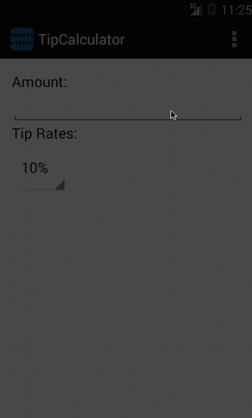

TipCalculatorApp
================

This is a Tip Calculator Android application for Android BootCamp Course.

Time spent: 6 hours spent in total

Completed user stories:

* [x] Required: User is displayed the tip of specified percentage for specified entered amount
* [x] Required: User enters the total amount of the transaction
* [x] Required: User can select between tip amounts (i.e 10%, 15%, 20%)
* [x] Required: Upon selecting tip amount, formatted tip value is displayed
* [x] Optional: User changes the total amount and updated tip is reflected automatically
* [x] Optional: User can select custom tip percentage if desired
* [x] Optional: User can edit preset tip percentages and have them persist across launches

Walkthrough of all user stories:

GIF created with [LiceCap](http://www.cockos.com/licecap/).
